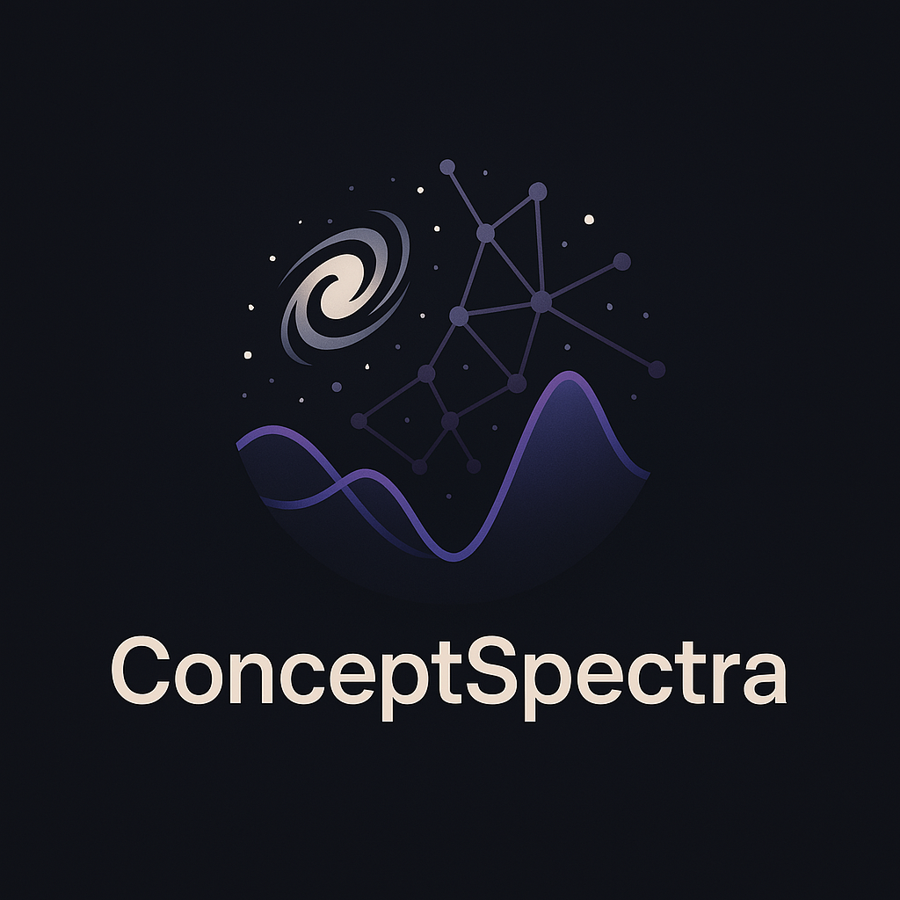

# CO*N*CEPTSpectra




[](https://doi.org/10.5281/zenodo.15187969)


<div align="justify">

CO*N*CEPTSpectra is a Python package that provides tools for computing the linear spectra of different species in cosmology. It integrates with CLASS (using CLASSY) deployed in CO*N*CEPT to compute background quantities, perturbations, and the corresponding power spectrum for various species. Users may either import the library in their own Python scripts or use the supplied command-line interface.

## Features

- Generate the power spectrum for several species: baryons, cold dark matter, dark energy fluid, and other relativistic species.

- Use in-memory and on-disk caching to reduce redundant CLASS computations.

- Flexible parameters: Users may supply their own CLASS parameters via the command line.

- Command-line interface for quick simulation runs.

## Dependencies

CO*N*CEPTSpectra has **one** primary dependency: [CO*N*CEPT](https://github.com/jmd-dk/concept/). It is designed to be used **only** with the Python environment that is installed alongside CO*N*CEPT.

## Installation

Clone the repository to your local machine:

```bash
git clone https://github.com/TiagoBsCastro/ConceptSpectra.git
```

Change into the repository directory:

```bash
cd ConceptSpectra
```

You may install the package locally using pip (optionally in editable mode):

```bash
(source ~/your_concept_path/concept && $python -m pip install -e .)
```

Alternatively, you may use the package directly without installation by ensuring that the CO*N*CEPTSpectra folder is in your Python path.

## Usage

CO*N*CEPTSpectra can be used in two ways: as an imported module within your own Python scripts or via the command-line interface.

### Library Usage

Below is an example of how to use CO*N*CEPTSpectra in your own Python script to compute the dark energy fluid power spectrum:

```python
import numpy as np
from ConceptSpectra import get_power, get_modes

# Define the cosmological parameters for a model with a dark energy fluid.
params = {
    # Cosmology parameters (with no cosmological constant; DE fluid is used instead)
    "H0": 67,                  # Hubble constant in km/s/Mpc
    "Omega_b": 0.049,          # Baryon density parameter
    "Omega_cdm": 0.27,         # Cold dark matter density parameter
    "Omega_Lambda": 0,         # No cosmological constant since DE fluid is used
    "w0_fld": -0.9,            # Dark energy fluid equation-of-state parameter, w0
    "wa_fld": 0.1,             # Dark energy fluid evolution parameter, wa
    "cs2_fld": 1e-5,           # Sound speed squared for the dark energy fluid
    "use_ppf": "no",           # Use ppf or fluid DE description
    # Primordial spectrum parameters
    "A_s": 2.1e-9,             # Amplitude of primordial perturbations
    "n_s": 0.96,               # Spectral index
    # Precision parameters for CLASS
    "l_max_g": 100,
    "l_max_pol_g": 100,
    "radiation_streaming_approximation": 3,
    "l_max_ur": 100,
    "ur_fluid_approximation": 3,
    "evolver": 0,
    "recfast_Nz0": 1e5,
    "tol_thermo_integration": 1e-6,
    "perturb_sampling_stepsize": 0.01,
    # Output settings
    "output": "dTk",
    # Generate modes as a formatted string using CO*N*CEPTSpectra's get_modes
    "k_output_values": get_modes(1e-3, 1e1, 30, as_str=True)
}

# Set the scale factor at which to compute the power spectrum.
# Here we choose a = 1.0, but this can be modified as needed.
a = 1.0

# Compute the DE fluid power spectrum using the "fld" species.
# Using the "nbody" gauge transformation for an example.
modes, de_power = get_power(params, "fld", "nbody", a=a)

# Rescale the k-modes and power spectrum for conventional usage.
# The reduced Hubble parameter h = H0/100 is used to obtain units of Mpc/h.
h = params["H0"] / 100.0

# Plot the computed results.
import matplotlib.pyplot as plt
plt.loglog(modes / h, de_power * h**3)
plt.xlabel(r"$k\,[{\rm Mpc}^{-1}\,h]$")
plt.ylabel(r"$P(k)\,[{\rm Mpc}^{3}\,h^{-3}]$")
plt.title("Dark Energy Fluid (DE fluid) Power Spectrum at scale factor a = {:.3f}".format(a))
plt.savefig("Pk-DE.pdf")

```
The above script is available as example.py and can be run as:
```bash
(source ~/your_concept_path/concept && $python example.py)
```

### Command-Line Interface (CLI) Usage

CO*N*CEPTSpectra includes a CLI that allows users to specify cosmological parameters. For example, to compute the power spectrum using custom parameters, run:

```bash
python -m ConceptSpectra.cli --H0 70 --Omega_b 0.05 --Omega_cdm 0.25 --w0_fld -1.05 --wa_fld 0.1 --cs2_fld 1e-4 --A_s 2.0e-9 --n_s 0.97 --a 0.8
```

This command will generate an output file (for example, in a directory named Pk) that contains the computed power spectrum data.

## Repository Structure
```bash
ConceptSpectra/
├── __init__.py          # Package initializer; exposes core functions.
├── computations.py      # contains the core cosmological functions.
├── setup.py             # contains the setup install.
└── cli.py               # Command-line interface for executing simulations.

```
## Contributing

Contributions are welcome. If you wish to extend the functionality of CO*N*CEPTSpectra or report issues, please open an issue or submit a pull request on GitHub.

## License

This project is provided under the MIT License. See the LICENSE file for details.

## Credits

The backbone of ConceptSpectra was developed by Jeppe Dakin.

## Contact

For additional questions, please contact the repository maintainer at tiago.castro@inaf.it.

</div>
